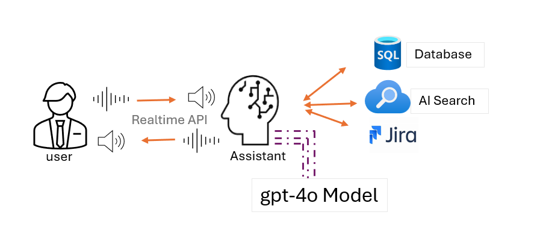

# Contoso Gaming Services - AI Assistant Demo - OpenAI Realtime Assistant
This demo application showcases an AI Assistant for Contoso Gaming Services with the following key features:
- It uses the gpt-4o realtime audio API features that provides real time conversation experience with the AI Assistant for users.

## Tags
[multimodal, audio]

# About this Demo Application

This demo application showcases an AI Assistant for Contoso Gaming Services with the following key features:
- It uses the gpt-4o realtime audio API features that provides real time conversation experience with the AI Assistant for users.
- have a transcript generated accompanying the audio conversation back and forth
- integration with Azure SQL Database, Jira Cloud and Azure AI Search using Tool calling

# Acknowledgements
This sample application uses the Realtime API Client framework ported from JS to python by Manoranjan Rajguru
It is available in this GitHub Repo [here](https://github.com/monuminu/AOAI_Samples/tree/main/realtime-assistant-support)

## Demo Video

To see the demo of this application in action, refer to this [YouTube video](https://youtu.be/nNa-ygGk62Y).




# Dependencies
- Azure SQL Database
- Jira Cloud
- Azure AI Search
- Install the ODBC Driver v18 for the operating system where this program is to be run

The tool calling here uses the above services to demonstrate how you can integrate with these services in a multimodal AI Assistant.


## Installation
1. Clone the repository:
    ```sh
    git clone https://github.com/your-repo/contoso-gaming-ai-assistant.git
    ```
2. Navigate to the project directory:
    ```sh
    cd contoso-gaming-ai-assistant
    ```
3. Create a virtual environment and activate it
    ```sh
    python -m venv venv
    source venv/bin/activate  # On Windows, use `venv\Scripts\activate`
    ```
4. Install the required dependencies:
    ```sh
    pip install -r requirements.txt

5. Set up environment variables by creating a [.env](http://_vscodecontentref_/1) file in the root directory and adding the following:
    ```env
    az_openai_key = ""
    az_openai_baseurl = "https://<>.openai.azure.com/"
    az_open_ai_endpoint_name = "<>"
    az_openai_type = "azure"
    az_openai_api_version = "2024-10-01-preview"
    deployment_name = "gpt-4o" 

    attlassian_api_key = ''
    attlassian_user_name = '<>'
    attlassian_url = 'https://<>.atlassian.net/'
    grievance_project_key = 'CN'
    grievance_type = 'Task'
    grievance_project_name = 'ContosoGamingSupport'
    
    ai_search_url = "https://<>.search.windows.net"
    ai_search_key = ""
    ai_index_name = "contoso-gaming-index"
    ai_semantic_config = "contoso-gaming-config"

    az_db_server = "<>.database.windows.net" 
    az_db_database = "<>" 
    az_db_username = "<>" 
    az_db_password = "<>"
    ```
6. Refer to the data folder in the repo to:
- Use the sql script to create the database and populate the table with sample data
- Use the FAQ sample txt files to create an Azure AI Search index
- Create a Jira account for registering the grievance
## Usage
1. Configure the application by editing the [config.toml](http://_vscodecontentref_/0) file as needed.
2. Run the application:
    ```sh
    chainlit run app.py -w
    ```
